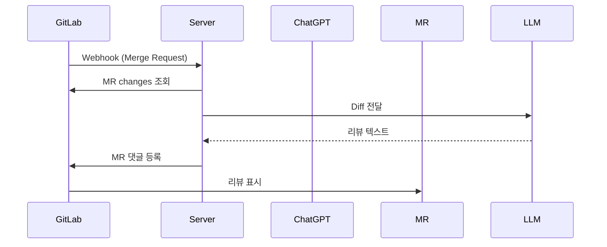
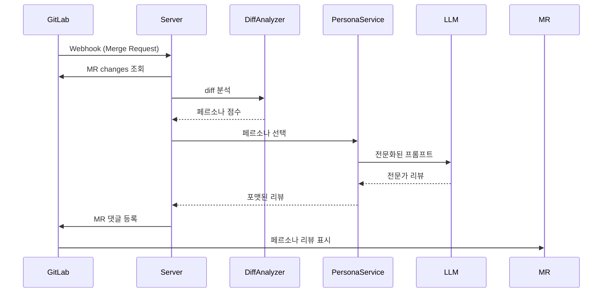

# 🚀 GitLab Merge Request Auto Code Review

**GitLab MR 자동 코드 리뷰 서비스**  
GitLab Merge Request 이벤트가 발생하면 Webhook을 통해 Spring Boot 서버가 호출되고, 다양한 LLM API(OpenAI ChatGPT, Anthropic Claude, Google Gemini) 중 한 개를 사용해 자동으로 **코드 리뷰**를 생성하여 GitLab MR에 리뷰를 작성합니다.

---

## ✨ 주요 기능
- GitLab **Merge Request Hook** 이벤트 수신
- MR 변경사항(Diff) 분석 및 다중 LLM API 호출
- OpenAI ChatGPT, Anthropic Claude, Google Gemini 지원
- **페르소나 기반 전문화된 리뷰** - 변경사항에 따라 적절한 전문가 관점 자동 선택
- 한국어 기반 **자동 코드 리뷰** 작성
- 실패 시 재시도 / CircuitBreaker / Retry 전략 적용

---


## 🤖 AI 페르소나 시스템

### 🎭 지원하는 전문가 페르소나
변경사항을 자동 분석하여 가장 적절한 전문가 페르소나를 선택합니다.

#### 🔍 도메인별 전문가
| 아이콘 | 페르소나 | 설명 |
|--------|-----------|------|
| 🔒 | **Security Auditor** | 보안 취약점, 인증/인가, 입력 검증 전문 |
| ⚡ | **Performance Tuner** | 성능 최적화, 쿼리 튜닝, 메모리 사용량 전문 |
| 🗃️ | **Data Guardian** | 데이터베이스, 트랜잭션, 데이터 정합성 전문 |
| 💼 | **Business Analyst** | 비즈니스 로직, 도메인 규칙, 요구사항 전문 |
| 🏗️ | **Architect** | 소프트웨어 아키텍처, 설계 패턴, 의존성 관리 전문 |
| ✅ | **Quality Coach** | 코드 품질, 테스트 전략, 컨벤션 전문 |

#### 🛠️ 기술 스택별 전문가
| 아이콘 | 페르소나 | 설명 |
|--------|-----------|------|
| ⚙️ | **Backend Specialist** | Spring Boot, FastAPI, 서버 아키텍처 전문 |
| 🎨 | **Frontend Specialist** | React, JavaScript/TypeScript, UI/UX 전문 |
| 🚀 | **DevOps Engineer** | Docker, Kubernetes, CI/CD, 인프라 전문 |
| 📊 | **Data Scientist** | Python, 머신러닝, 빅데이터, AI/ML 파이프라인 전문 |
| 🤖 | **General Reviewer** | 종합적인 코드 품질 검토 |

---


### 🧠 스마트 페르소나 선택 시스템
- **파일 경로 분석**: controller, service, component 등 경로 패턴
- **파일 확장자 분석**: `.java`, `.py`, `.js`, `.tsx`, `.sql` 등
- **코드 키워드**: `@PreAuthorize`, `@Cacheable`, `useState` 등 프레임워크별 어노테이션
- **복잡도 패턴**: 중첩 반복문, 예외 처리, 비동기 코드 등
- **임계값 기반 선택**  
  - 40점 이상: 전문 페르소나 자동 활성화  
  - 60점 이상: 추가 점검용 다른 페르소나도 함께 제안

---

### 📝 리뷰 모드 설정
```properties
# 페르소나 기반 전문화된 리뷰 (권장)
app.review.mode=persona

# 기존 통합 LLM 리뷰
app.review.mode=integrated
```

---

## 🤖 지원 LLM 모델
#### OpenAI
- gpt-4o-mini 
- gpt-4o, gpt-4-turbo
- API 키: OpenAI Platform

#### Anthropic Claude
- claude-sonnet-4-20250514 
- claude-opus-4, claude-haiku-4
- API 키: Anthropic Console

#### Google Gemini
- gemini-2.5
- gemini-1.5-pro, gemini-1.5-flash
- API 키: Google AI Studio

---

## 🪝 GitLab Webhook 생성 방법

아래 순서대로 설정하면 MR 이벤트가 서버로 안전하게 전달됩니다.

### 1) 이동 경로
- GitLab 프로젝트 → **Settings > Webhooks**

### 2) 기본 설정
- **URL**
> 예) https://codereview.example.com/webhooks/gitlab  
> ⚠️ IP(예: https://<PUBLIC_IP>/...)가 아닌 **도메인**을 사용해야 SSL 인증서 검증이 올바르게 동작합니다.
- **Secret Token**
- `.env`의 `GITLAB_WEBHOOK_SECRET` 값과 **동일하게** 입력  
- 서버는 요청 헤더 `X-Gitlab-Token`을 검증합니다.

- **Trigger Events**
- ✅ **Merge request events** (권장: 이 항목만 체크)

- **Enable SSL verification**
- ✅ 체크 (정상 인증서 사용 시 권장)
- 임시 테스트 목적이 아니라면 해제하지 마세요.

### 3) 고급/선택 설정
- **Push/Issue/Tag 등 다른 이벤트 비활성화** → 노이즈 최소화
- **Confidential events** 불필요 시 비활성화
- 자체 호스팅 GitLab(예: `https://lab.ssafy.com`)도 **동일한 절차**로 설정

---

### 4) 설정 검증 (두 가지 방법)

**A. GitLab에서 Test 전송**
1. Webhook 목록에서 **“Test” → “Merge request events”** 클릭  
2. **Response**가 `2xx`이면 성공

**B. cURL로 직접 점검 (서버 측 연결/토큰 확인)**
```bash
curl -i -X POST "https://<YOUR_SERVER_DOMAIN>/webhooks/gitlab" \
-H "Content-Type: application/json" \
-H "X-Gitlab-Event: Merge Request Hook" \
-H "X-Gitlab-Token: <GITLAB_WEBHOOK_SECRET>" \
--data '{"object_kind":"merge_request","event_type":"merge_request","object_attributes":{"iid":1,"state":"opened"}}'
기대 결과: HTTP/1.1 2xx

4xx/5xx 발생 시 서버 로그를 확인하세요.
```

---

## 5) 자주 발생하는 이슈 & 해결

### 🔒 SSL 인증서 오류 (hostname mismatch)
- **증상**: `certificate verify failed (hostname mismatch)`
- **원인**: 인증서의 CN/SAN에 요청 도메인이 포함되지 않음, 또는 IP로 호출
- **해결 방법**:
  1. Webhook URL을 **도메인**으로 설정 (예: `https://codereview.example.com/...`)
  2. Nginx `server_name`이 도메인과 일치하는지 확인
  3. 인증서를 해당 도메인으로 발급 (예: Let’s Encrypt `certbot`)
  4. 아래 명령어로 인증서 확인
     ```bash
     openssl s_client -connect codereview.example.com:443 -servername codereview.example.com
     ```

### 🔑 403/401 오류 (비밀 토큰 불일치)
- **원인**: GitLab Webhook의 Secret Token과 `.env`의 `GITLAB_WEBHOOK_SECRET` 값이 불일치
- **해결 방법**: 두 값을 동일하게 맞추기

### 🔔 타 이벤트로 인한 과도한 호출
- **원인**: Push/Issue 등 불필요한 이벤트까지 Webhook이 호출됨
- **해결 방법**: `Merge request events`만 체크했는지 재확인

### 🔥 방화벽/보안그룹 문제
- **원인**: 서버의 HTTPS(443) 포트가 외부에서 차단됨
- **해결 방법**: 보안 그룹/방화벽에서 443 포트를 개방

---

## 6) 동작 흐름 (기존 방식)

1. MR 생성/수정 → GitLab이 Webhook 호출  
2. 서버가 Secret Token 검증 후 MR 변경사항 조회  
3. ChatGPT API 호출 → 리뷰 텍스트 생성  
4. GitLab MR에 댓글 등록



---

## 7) 동작 흐름 (페르소나 모드)

1. MR 생성/수정 → GitLab이 Webhook 호출
2. 서버가 Secret Token 검증 후 MR 변경사항 조회
3. diff 분석 → 페르소나별 점수 계산
4. 최적 페르소나 선택 (예: Backend Specialist)
5. 전문화된 프롬프트 생성 → LLM API 호출
6. 페르소나 리뷰 생성 → GitLab MR에 댓글 등록


