# 🚀 GitLab Merge Request Auto Code Review

**GitLab MR 자동 코드 리뷰 서비스**  
GitLab Merge Request 이벤트가 발생하면 Webhook을 통해 Spring Boot 서버가 호출되고, OpenAI ChatGPT API를 이용해 자동으로 **코드 리뷰**를 생성하여 GitLab MR에 리뷰를 작성합니다.

---

## ✨ 주요 기능
- GitLab **Merge Request Hook** 이벤트 수신
- MR 변경사항(Diff) 분석 및 ChatGPT API 호출
- 한국어 기반 **자동 코드 리뷰** 작성
- 실패 시 재시도 / CircuitBreaker / Retry 전략 적용

---

## 🪝 GitLab Webhook 생성 방법

아래 순서대로 설정하면 MR 이벤트가 서버로 안전하게 전달됩니다.

### 1) 이동 경로
- GitLab 프로젝트 → **Settings > Webhooks**

### 2) 기본 설정
- **URL**
> 예) https://codereview.example.com/webhooks/gitlab  
> ⚠️ IP(예: https://<PUBLIC_IP>/...)가 아닌 **도메인**을 사용해야 SSL 인증서 검증이 올바르게 동작합니다.
- **Secret Token**
- `.env`의 `GITLAB_WEBHOOK_SECRET` 값과 **동일하게** 입력  
- 서버는 요청 헤더 `X-Gitlab-Token`을 검증합니다.

- **Trigger Events**
- ✅ **Merge request events** (권장: 이 항목만 체크)

- **Enable SSL verification**
- ✅ 체크 (정상 인증서 사용 시 권장)
- 임시 테스트 목적이 아니라면 해제하지 마세요.

### 3) 고급/선택 설정
- **Push/Issue/Tag 등 다른 이벤트 비활성화** → 노이즈 최소화
- **Confidential events** 불필요 시 비활성화
- 자체 호스팅 GitLab(예: `https://lab.ssafy.com`)도 **동일한 절차**로 설정

---

### 4) 설정 검증 (두 가지 방법)

**A. GitLab에서 Test 전송**
1. Webhook 목록에서 **“Test” → “Merge request events”** 클릭  
2. **Response**가 `2xx`이면 성공

**B. cURL로 직접 점검 (서버 측 연결/토큰 확인)**
```bash
curl -i -X POST "https://<YOUR_SERVER_DOMAIN>/webhooks/gitlab" \
-H "Content-Type: application/json" \
-H "X-Gitlab-Event: Merge Request Hook" \
-H "X-Gitlab-Token: <GITLAB_WEBHOOK_SECRET>" \
--data '{"object_kind":"merge_request","event_type":"merge_request","object_attributes":{"iid":1,"state":"opened"}}'
기대 결과: HTTP/1.1 2xx

4xx/5xx 발생 시 서버 로그를 확인하세요.
```

---

## 5) 자주 발생하는 이슈 & 해결

### 🔒 SSL 인증서 오류 (hostname mismatch)
- **증상**: `certificate verify failed (hostname mismatch)`
- **원인**: 인증서의 CN/SAN에 요청 도메인이 포함되지 않음, 또는 IP로 호출
- **해결 방법**:
  1. Webhook URL을 **도메인**으로 설정 (예: `https://codereview.example.com/...`)
  2. Nginx `server_name`이 도메인과 일치하는지 확인
  3. 인증서를 해당 도메인으로 발급 (예: Let’s Encrypt `certbot`)
  4. 아래 명령어로 인증서 확인
     ```bash
     openssl s_client -connect codereview.example.com:443 -servername codereview.example.com
     ```

---

### 🔑 403/401 오류 (비밀 토큰 불일치)
- **원인**: GitLab Webhook의 Secret Token과 `.env`의 `GITLAB_WEBHOOK_SECRET` 값이 불일치
- **해결 방법**: 두 값을 동일하게 맞추기

---

### 🔔 타 이벤트로 인한 과도한 호출
- **원인**: Push/Issue 등 불필요한 이벤트까지 Webhook이 호출됨
- **해결 방법**: `Merge request events`만 체크했는지 재확인

---

### 🔥 방화벽/보안그룹 문제
- **원인**: 서버의 HTTPS(443) 포트가 외부에서 차단됨
- **해결 방법**: 보안 그룹/방화벽에서 443 포트를 개방

---

## 6) 동작 흐름 (요약)

1. MR 생성/수정 → GitLab이 Webhook 호출  
2. 서버가 Secret Token 검증 후 MR 변경사항 조회  
3. ChatGPT API 호출 → 리뷰 텍스트 생성  
4. GitLab MR에 댓글 등록

```mermaid
sequenceDiagram
  participant GitLab
  participant Server
  participant ChatGPT
  participant MR

  GitLab->>Server: Webhook (Merge Request)
  Server->>GitLab: MR changes 조회
  Server->>ChatGPT: Diff 전달
  ChatGPT-->>Server: 리뷰 텍스트
  Server->>GitLab: MR 댓글 등록
  GitLab->>MR: 리뷰 표시
```


